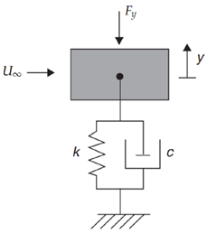
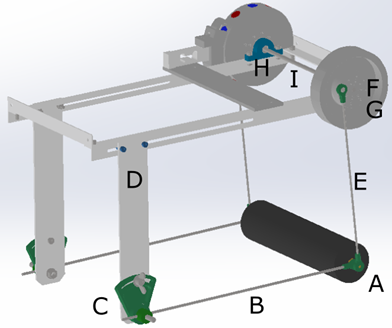

# H-HOPE DIY energy harvester mechanical design
As previously discussed, the goal of the **WP8 work package of the H-Hope project** was to develop a VIV energy harvester that is easy to build, functional, and reliable using DIY and additive manufacturing methods. This section will focus on the mechanical part of the DIY energy harvester in the H-Hope project aimed at converting the water flow energy through the cylinder oscillating movement into the mechanical energy of a the rotating or oscillating shaft. 

Since the goal of the Knowledge Hub is to provide information to potential prosumers, in the following sub-sections, the mechanical operation (subsection 3.5.1) and a possible design (subsection 3.5.2) will be explained. **We must note once again that this is not the final design of the H-Hope DIY energy harvester, as this will be published in the deliverable D8.3.**

## **Physical operation**
In the H-HOPE project, the energy harvester is designed to convert water energy into mechanical motion, and then into electricity. To understand the resulting design of the H-HOPE harvester, the system needs to be simplified into a basic mechanical model, properly representing the mechanical behaviour of the harvester: a mass (m) attached to a spring (k) and a damper (c), as shown in Figure 8. The cylinder (represented by a grey box in Figure 1), free to oscillate in a direction y normal to the water flow, is attached to a spring with spring constant k, and damped by the induction generator or frictional forces (c).
 

Figure 1. Scheme of the simplified mechanical model for representing the H-HOPE harvester.

As explained in the previous sections, the water flow creates a vortex shedding that push and pull on the cylinder with lift force Fy generating an up and down movement. 
This fluid-mechanical motion can be modelled according to the scheme in Figure 8:
-	the mass represents the cylinder (and nearby water) weight and inertia.
-	the spring brings the cylinder back toward its starting point.
-	the damper slows down its motion. For instance, the damping action can be provided by the induction generator braking or by the friction in the bearings.
To design an efficient energy harvester, maximizing the energy exploitation, it has been already explained that **the natural frequency of the system has to match vortices shedding frequency.** When these two frequencies are synchronized, the lock-in condition is reached, and the cylinder vibrates strongly and steadily. So, the mechanical system has to be designed accordingly, and this requires a multi-disciplinary design approach considering the fluid-structure interaction (see Deliverable D4.1).
To do this, several important non-dimensional numbers have to be introduced:
-	The reduced velocity measures how fast the water is moving compared to the natural vibration of the object.
-	The Strouhal number (see Equation 1) relates to how often the vortices are created behind the object.
-	The Reynolds number captures the flow characteristics depending on water speed, object size, and fluid properties.
Designing the mechanical components of the harvester means adjusting properties like the cylinder size, shape, mass, and stiffness to achieve the lock-in condition under typical flow conditions.

## **Mechanical design of the H-Hope energy harvester**
Starting from the principle of operation described in the previous sub-section and keeping in mind the DIY approach, the mechanical schematic design of the H-Hope DIY energy harvester has been developed and is shown in Figure 9. The oscillating cylinder (A) is mounted horizontally and supported on each end by horizontal springs (B) made from stainless steel rods of specific lengths and diameters. These springs constrain movement in the horizontal (flow) direction while allowing vertical oscillations. A spring preloading mechanism (C) adjusts the equilibrium position of the cylinder: lighter cylinders require less preload, while heavier ones (made from material with high density such as steel) require more preload to maintain the balance. The choice of the material depends on the flow characteristics since it affects the fluid-structure interaction. However, since all components, including the cylinder, are submerged, they have to be fabricated from water-resistant materials such as stainless steel or durable plastics to ensure longevity.
As previously explained, the cylinder vertical motion is influenced by several factors, among which the fluid forces acting on the cylinder, the spring constant (determined by rod diameter and length), the damping effects (from mechanical friction and electricity generation), and the system mass (cylinder and all the components in motion).
To transfer motion to the induction generator, two vertical rods (E in Figure 9) — each equipped with bearings — connect the cylinder to the power transmission system. These rods enable smooth movement and link the cylinder to the main shaft, which is also supported by bearings. The vertical oscillation is converted into rotary oscillation at the generator shaft. Although not shown in Figure (2), a gear multiplier (multiplicator) can be used to connect the shaft to the induction generator, increasing its angular displacement and thus the voltage output.

 

Figure 2. Possible H-Hope Harvester mechanical design. The indicated parts are: A) cylinder with connecting adapter (green part), B) return spring, C) preloading mechanism for the return spring, D) mechanical support, E) connecting rod, F) rotor, G) flywheel, H) bearings and I) shaft.  The Figure is shown for the DIY harvester with cylinder diameter D=60 mm and cylinder length l=250 mm.

All components are mounted on a modular aluminium frame, whose elements are secured with bolts, washers, and nuts. The frame provides a straightforward method for mounting the harvester to channel walls, though users may need to adapt the design to suit specific installation conditions.

